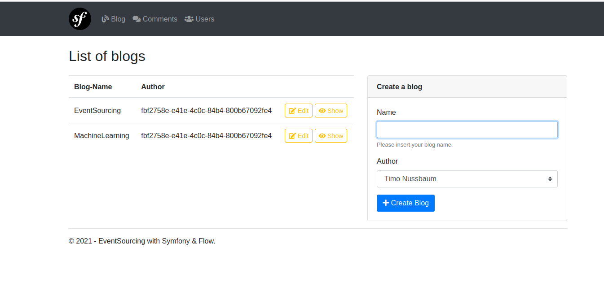

## Eventsourcing with Symfony & Flow

This example demonstrates EventSourcing with symfony & flow.

It is heavily inspired by the escr-test-distribution (https://github.com/bwaidelich/escr-test-distribution).
Thanks goes to <b>Bastian Waidelich & Sebastian Kurfürst!</b> Without them the demo would not have been created.



### Installation

<details><summary>With Docker</summary>

```
cd .docker
```

Change the path to your local directory

```
vim .env
```

```
docker-compose up -d
```

Execute into the event-sourcing.app container

```
docker exec -it eventsourcing-app bash
```

#### Inside the container

```
composer install
```

Migrate the domain models (for this example)

```
php bin/console doctrine:migrations:migrate
```

If you want to use phpMyAdmin you have to do some additional work.

```
docker exec -it eventsourcing-mysql bash
```

Open the mysql console

```
mysql -uroot -proot
```

Execute the following two commands

```
ALTER USER 'root'@'localhost' IDENTIFIED WITH mysql_native_password BY 'root';
ALTER USER 'root'@'%' IDENTIFIED WITH mysql_native_password BY 'root';
```

#### Browser

Open your browser and insert localhost

</details>

<details><summary>With Vagrant / local Web Server</summary>

Navigate to your project directory. 

Migrate the domain models (for this example)

```
php bin/console doctrine:migrations:migrate
```

</details>

### Usage

#### Important notice

Before you can start to play around with the demo be sure, that you messenger is 
running. The projections are created asynchronous (with the well known catch-up subscription)

```
php bin/console messenger:consume -vvv
```


#### Writing events

In the symfony controller the commands are created and routed to the 
corresponding command handler. For the blogging context the BlogController 
creates the CreateBlog command and routes it to the BloggingCommandHandler. 
In the handleCreateBlog function the event is stored. 

<details><summary>Example event: <i>BlogWasCreated.php</i></summary>

```php
class BlogWasCreated implements EventInterface
{
    public function __construct(
        private readonly BlogIdentifier $id,
        private readonly string $name,
        private readonly UserIdentifier $author
    ) {
    }

    public function getId(): BlogIdentifier
    {
        return $this->id;
    }

    public function getName(): string
    {
        return $this->name;
    }

    public function getAuthor(): UserIdentifier
    {
        return $this->author;
    }

    public static function fromArray(array $values): EventInterface
    {
        return new self(
            BlogIdentifier::fromString($values['blogIdentifier']),
            $values['name'],
            UserIdentifier::fromString($values['author'])
        );
    }

    public function jsonSerialize(): array
    {
        return [
            'blogIdentifier' => $this->id,
            'name' => $this->name,
            'author' => $this->author,
        ];
    }
}
```
</details>

```php
<?php
$blogIdentifier = BlogIdentifier::fromString(Uuid::uuid4()->toString());
$event = new BlogWasCreated(
    $command->getId(), 
    $command->getName()
);

return $this->eventStore->commit($blogIdentifier, DomainEvents::withSingleEvent(
    $event
));
```

#### Reading events

The BloggingCommandHandler can also react to a read command.
The function handleStream returns the event stream.

```php
<?php
$eventStream = $this->eventStore->load($blogIdentifier)
```

#### Reacting to events

In order to react upon new events you'll need an event listener.
The listeners are called with the when*" namings in this example. 
For the event BlogWasCreated the listenerMethodName 
is 'whenBlogWasCreated'. 

*Feel free to change the naming in the ProjectionTrait.* 

<details><summary>Example projection: <i>BlogProjection.php</i></summary>

```php
<?php
class BlogProjection implements ProjectionInterface
{
    use ProjectionTrait;

    public function __construct(
        private readonly Connection $connection,
        private readonly BlogRepository $blogRepository,
        private readonly EventNormalizer $eventNormalizer,
        private readonly CommentRepository $commentRepository
    ) {
    }

    public function whenBlogWasCreated(BlogWasCreated $event)
    {
        $this->blogRepository->addByEvent($event);
    }

```
</details>

In our example listener (BlogProjection) we created the function whenBlogWasCreated(...).
Now the 'catchUp' can inform the listener about changes (new events added to the stream).
Alexey Zimarev wrote a good article about subscriptions (https://zimarev.com/blog/event-sourcing/projections/).
Also about checkpoints. 

```php
public function catchUp(EventStoreInterface $eventStore): void
    {
        $eventStream = $eventStore->load(
            VirtualStreamName::forCategory($this->getPartitionName())
        );

        $checkpointStorage = $this->getCheckpointStorage();

        $catchUp = CatchUp::create(function (EventEnvelope $eventEnvelope) {
            $this->apply($eventEnvelope);
        }, $checkpointStorage);

        $catchUp->run($eventStream);
    }
```

<b>Note:</b> The listener has to implement the `ProjectionInterface`. Otherwise it will not work properly.

#### Event normalizer

If you are going to create a new event you have to add it to the knownEvents
of the EventNormalizer. 

```php
private array $knownEvents = [
    'UserWasCreated' => UserWasCreated::class,
    'UserWasUpdated' => UserWasUpdated::class,
    'BlogWasCreated' => BlogWasCreated::class,
    'BlogWasUpdated' => BlogWasUpdated::class,
    'CommentWasCreated' => CommentWasCreated::class,
];
```


#### Replay projections

With the following command you can rebuild all the projections. 

```php
bin/console eventsourcing:projection-replay-demo
```

### Trouble

Perhaps you have to change the file permissions


### Keep your code clean

For this package I used rector and the easy coding standard. 
You can use it with the following commands:

```
vendor/bin/rector

vendor/bin/ecs check src --fix
```

### Tests 

A good starting point

```
bin/phpunit tests/Unit/
```
